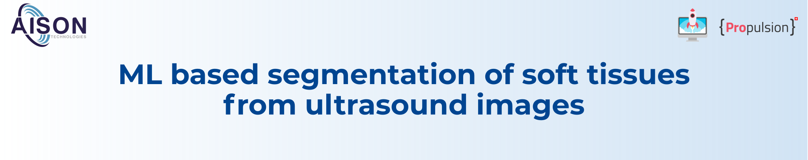
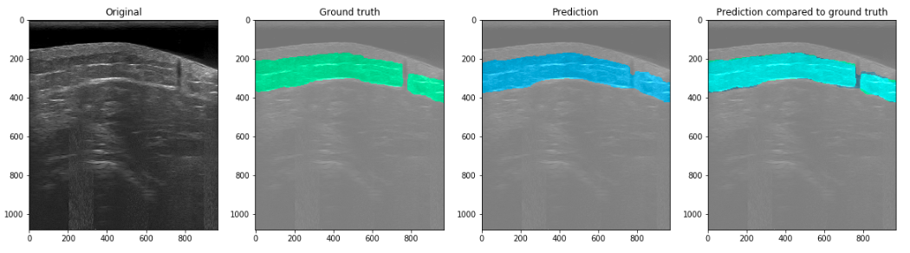
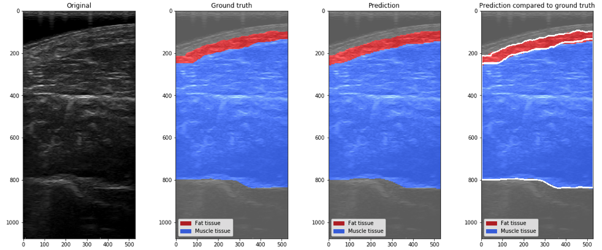
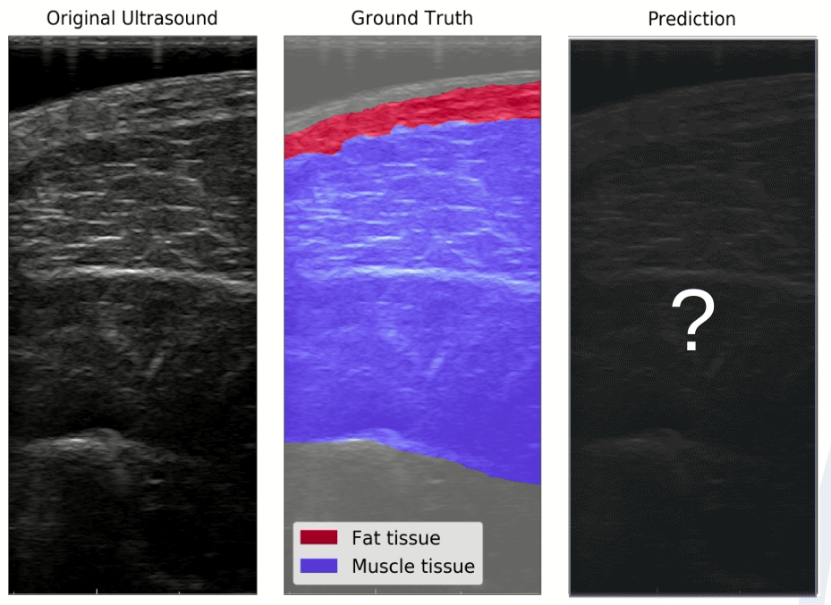
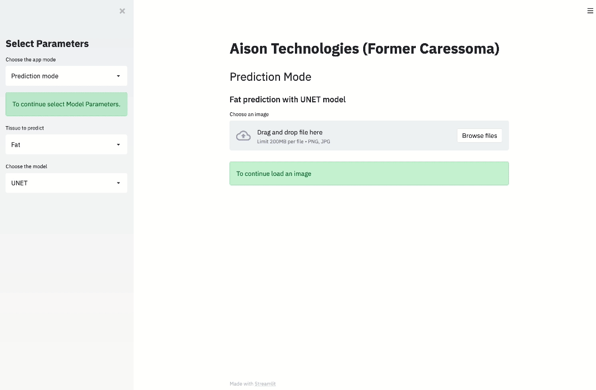

# US-segmentation

This repository contains a simplified version of the Propulsion Academy final project on ultrasound image segmentation presented on November 20th 2020. It does not include the data base.
The project was done in collaboration with [Aison Technologies](https://www.aisontechnologies.com) (former Caressoma).

## Authors
[Leticia Fernandez Moguel](https://www.linkedin.com/in/leticia-fernandez-moguel-phd/),  [Roman Grisch](https://www.linkedin.com/in/romangrisch/), [Nicolas Bernath](https://www.linkedin.com/in/nicolasbernath/) 

## Supervisors
 [Marie Bocher](https://www.linkedin.com/in/marie-bocher-8b6b5562/), [Badru Stanicki](https://www.linkedin.com/in/badru-stanicki-087703187/)

## Project summary

Ultrasound (US) has become an increasingly popular diagnostic tool for visualizing soft tissue in all areas of medicine. However, US images are difficult to interpret; identifying tissues such as fat,
muscle, tendons, ligaments requires a trained specialist. 

We have developed a tool to identify such tissues on ultrasound images based 
on a deep learning model with a UNET architecture. The potential uses of this model are numerous: 
- assisting healthcare providers with US diagnosis 
- enable non-experts (e.g. physical therapists, personal trainers) to carry out US screenings 
- Disclaimer: The medical diagnosis remains in the hands of the doctors.
- implentation in 3D ultrasound tomography (like an MRI or CT, but based on ultrasound technology)

## Example Results
The figures below show the outputs of the models when running them with the Jupyter notebook. They allow to see the ultrasound image, the mask, how the model predicted the mask and lastly, a comparison between predicted & actual mask.

#### Binary Model

#### Multiclass Model

#### Visualization of model training (backpropagation in neural network)

##  App

An App was created with [streamlit](https://www.streamlit.io). The App contains a Demo mode showing pre-loaded predictions, an animation of the training progress and the prediction mode which predict ultrasound segmentation on the spot. The prediction mode is not included in the public version of the App.
To run the App it is necessary:
- Clone on a local PC this repo
- Make sure the environment from the requirement section is installed
- IMPORTANT: Keep the folder structure
- Open the terminal at the App folder and type: `streamlit run AISON_APP.py`

#### Example of the App in use: predicting body tissue on new US image

